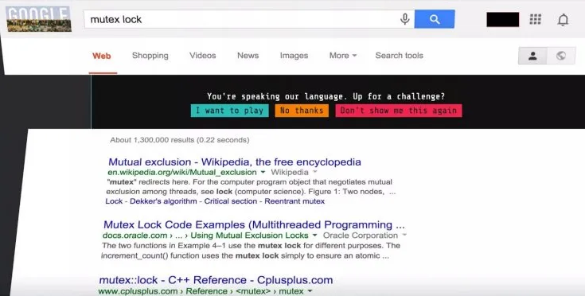
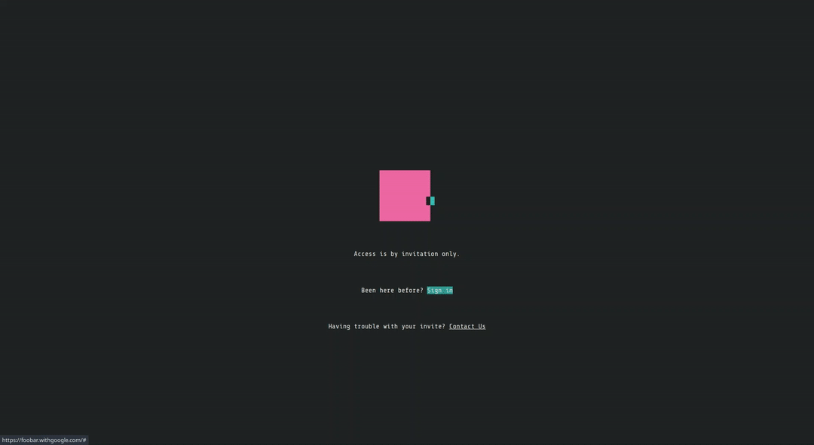

# Google Foobar Submission

[Google Foobar](https://www.freecodecamp.org/news/the-foobar-challenge-googles-hidden-test-for-developers-ed8027c1184/) is a way for Google to recruit developers based on search history - roughly determing basic skill level & area(s) of competency.

Rather than sifting through a list of applicants (of undetermined skill) or trying to entice people through emails or recruiters, instead pique their interest with an invitation only challenge through *Google.com*.

## Foobar Invite

Once you've gotten over the surprise of the immutable Google search changing you can start to *play*.

### **Source:** [IBTimes](https://www.ibtimes.co.uk/google-foobar-how-searching-web-earned-software-graduate-job-google-1517284)

## Foobar Login

## Todo

Add all solutions to completed challenges (time is constraind at the moment)
